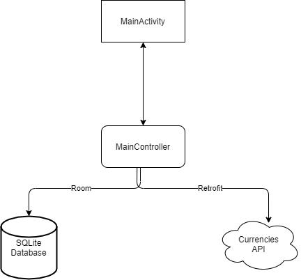
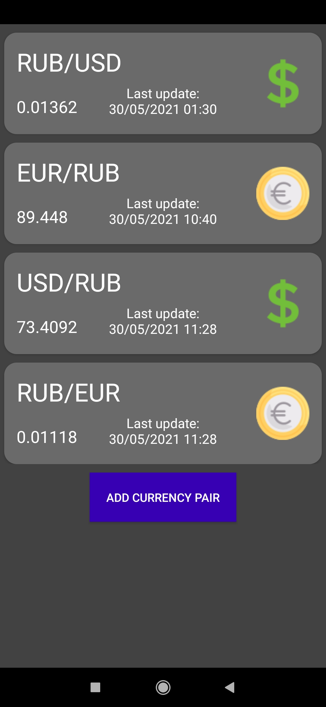
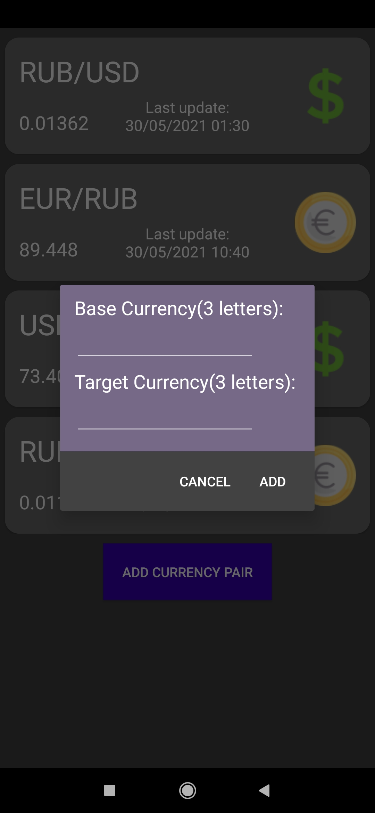
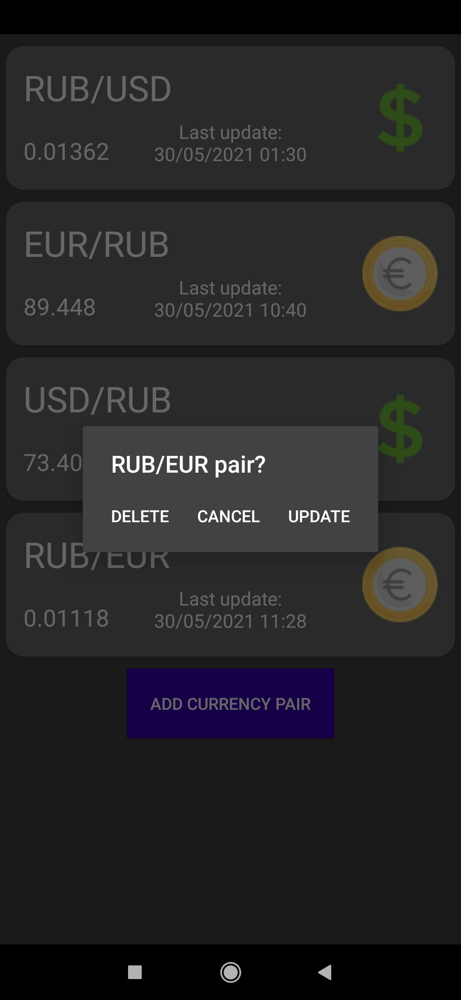

# Currencies

## Idea of the app is the following:
+ Provide a possibility to store and check currenciy rates with help of outside API.

# Technology stack
+ Java as main programming language
+ Dagger2 as tool for structuring
+ Retrofit2 as tool to working with outside API
+ Room2 as tool to working with SQLite database
+ <a href = https://app.exchangerate-api.com/>Exchange-Rate-API- API for currency rates</a>

# App schema

# Screenshots

## Main screen which displays all previously added currency rates:

## Dialog for working with currency rate addition:

## Dialog through which user can update/delete the currency rate:

# Further improvements:
+ Added currency rates could be updated automatically, e.g. 1 update per 10 seconds.

